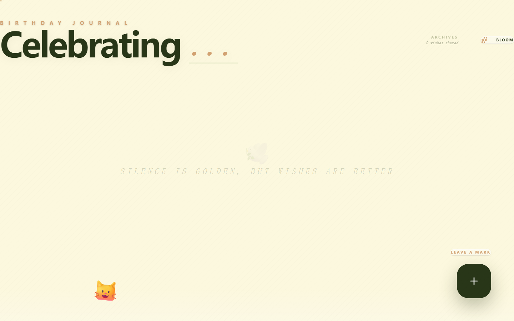

# 生日祝福墙

> 访客留言、送礼祝福，给 TA 一个温暖的生日惊喜

一个全栈生日留言墙应用。朋友们的祝福化作卡片飘落在页面上，还可以送虚拟礼物、和桌面宠物互动。

## 在线体验

[https://8tspyt5ntp.coze.site](https://8tspyt5ntp.coze.site)

## 预览

<p align="center">
  
</p>

## 功能

- **祝福卡片墙** — 访客留下祝福，以卡片形式展示
- **虚拟礼物** — 蛋糕、蜡烛、花束、气球、星星、烟花，送给任意祝福
- **桌面宠物** — 可爱的桌面小角色，会回应你的互动
- **庆祝动效** — 彩纸飘落、烟花绽放、花瓣飘落等动画
- **口令保护** — 可选的密钥验证，限制随意发帖
- **响应式设计** — 手机和电脑都能用

## 技术栈

| 层 | 技术 |
|----|------|
| 前端 | React 19 + TypeScript + Tailwind CSS + Motion |
| 后端 | Vercel Serverless Functions (Node.js) |
| 数据库 | Upstash Redis (Vercel KV) |
| 部署 | Vercel |

## 快速开始

1. **克隆并安装依赖：**
   ```bash
   git clone https://github.com/BallCard/birthday-message-wall.git
   cd birthday-message-wall
   npm install
   ```

2. **部署到 Vercel：**
   ```bash
   vercel --prod
   ```

3. **配置数据库：**
   - Vercel 控制台 → Storage → 创建 **Upstash for Redis**
   - 关联到你的项目

4. **配置环境变量**（Vercel 控制台 → Settings → Environment Variables）：

   | 变量 | 必需 | 说明 |
   |------|------|------|
   | `BIRTHDAY_PERSON` | 是 | 寿星的名字 |
   | `KV_REST_API_URL` | 自动 | Upstash 自动注入 |
   | `KV_REST_API_TOKEN` | 自动 | Upstash 自动注入 |
   | `PASSPHRASE_ENABLED` | 可选 | 设为 `true` 启用口令保护 |
   | `PASSPHRASE_SECRET` | 可选 | 口令内容（默认 `birthday2024`） |
   | `CORS_ORIGINS` | 可选 | 逗号分隔的允许来源 |

5. **重新部署**，然后分享链接！

## 项目结构

```
├── api/                    # Vercel Serverless Functions
│   ├── _lib/               # 共享工具（校验、限流、CORS）
│   ├── config.js           # GET /api/config
│   ├── messages.js         # GET/POST /api/messages
│   ├── gifts.js            # GET /api/gifts
│   └── gifts/send.js       # POST /api/gifts/send
├── src/                    # React 前端
│   ├── components/         # MessageCard、SubmitForm、DesktopPet 等
│   ├── services/           # 音效服务（Web Audio API）
│   └── types.ts            # TypeScript 类型定义
├── docs/                   # 设计文档
└── vercel.json             # 构建和路由配置
```

## License

MIT
